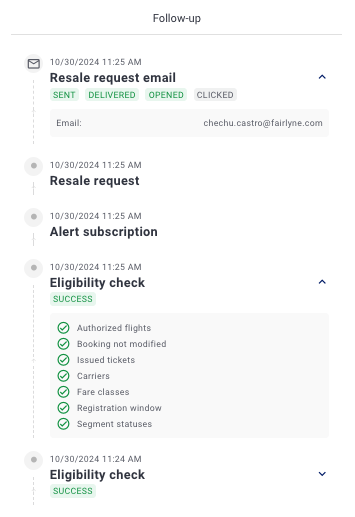

# Fairlyne Frontend Test

Ce dépôt contient le projet pour le test frontend de Fairlyne.

## Informations sur le dépôt

- **URL du dépôt GitHub** : [https://github.com/chechucastro/fairlyne-frontend-test](https://github.com/chechucastro/fairlyne-frontend-test)
- **URL Git** : `https://github.com/chechucastro/fairlyne-frontend-test.git`
- **Branche principale** : `main`
  > ⚠️ **Important** : Veuillez **ne pas pousser directement** sur la branche `main`. Créez une nouvelle branche ou soumettez une pull request.

## Lancer le projet

Pour exécuter le projet localement :


1. Naviguez vers le dossier racine du client
2. Exécutez la commande suivante :
   ```bash
   npm install
   npm run dev
   ```
3. Naviguez vers le dossier racine du serveur
4. Exécutez la commande suivante :
   ```bash
   npm install
   npm run start 
   ```

## Réalisation du test

Ce test est à réaliser en Vue 3 et en TypeScript.

Toute librairie de composants ou de style est autorisée, ainsi que tout autre type de librairie (pinia, vitest etc...)

Ce test technique sera évalué non seulement sur la fonctionnalité du code, mais également sur sa qualité, sa lisibilité, et son respect des bonnes pratiques de développement.

## Test


Réalisation d'un tableau permettant d'afficher les demandes de reventes des clients. Ces demandes sont identifiées à l'aide du PNR (Passenger Name Record) qui est l'identifiant de la réservation du client. Lors de la sélection d'un PNR, les informations de celui-ci sont affichées dans un panel sur la droite.

Nous devons pouvoir trier dans cette liste via une barre de recherche, le tri doit se faire sur le N°PNR

En en-tête de ce panel on y trouve 3 informations :
- Le status de la resale
- La derniere date de modification
- L'adresse email

Suivi d'une partie historique, ce composant est le fil d'ariane de la resale.



Les éléments de la liste sont triés par date de modification et il y a 3 grand type d'éléments :
- Les status
- Les emails
- Les états de l'eligibilité

